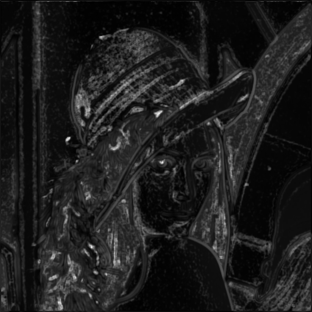

# Just Noticeable Difference
It's a repository to caculate the just noticable difference of an image by **Python**.

## Collected Method
 - Enhanced Just Noticeable Difference Model for Images With Pattern Complexity
    - [**Paper**](https://ieeexplore.ieee.org/document/7885108)
    - [**Official implementation**](https://web.xidian.edu.cn/wjj/index.html) (Matlab)

    Clean Image             |  JND Image | Disturbed Image
    :-------------------------:|:-------------------------:|:-------------------------:|
      |   | 